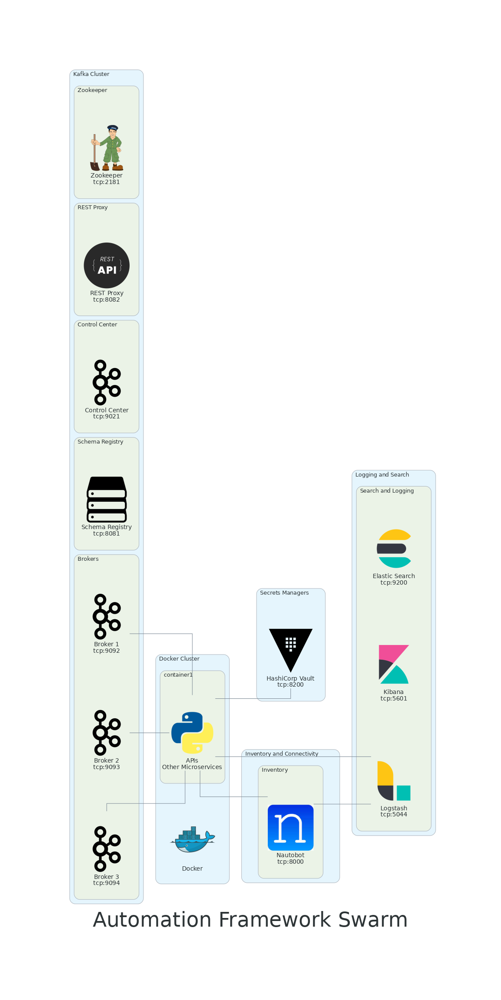
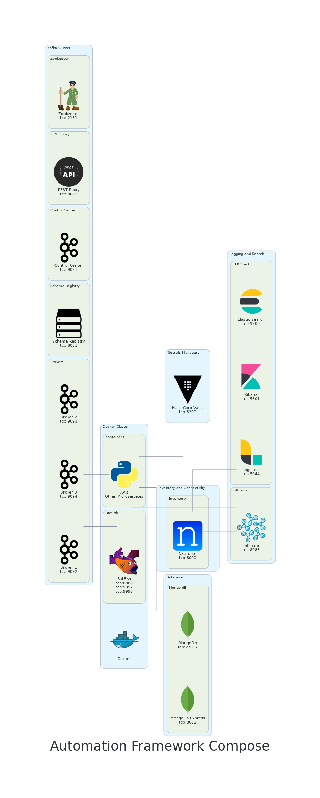

# automation-framework
Automation Framework

**This is not meant to be in production, this is a development environment**

## General Information

* The base Makefile is meant to be used with Docker Swarm

* The Makefile located in docker/compose is used for individual architecture pieces

* **Compose** does not have memory limits

### Possible Special Need for ELK

* You may need to run this command on the host system

```text
sysctl -w vm.max_map_count=262144
```

### Nautobot required after creating container

* You need to create a super user use the following command, and follow prompts.

```text
docker exec -it <container-name> nautobot-server createsuperuser
```

### Information URLs

* [vm.max_map_count](https://www.elastic.co/guide/en/elasticsearch/reference/5.0/vm-max-map-count.html#vm-max-map-count)
* [curl examples send data to ELK](https://mindmajix.com/elasticsearch/curl-syntax-with-examples)
* [nautobot-lab reference](https://github.com/nautobot/nautobot-lab)

### What is Available in Swarm

| ARCHITECTURE | USED FOR |
|---|---|
| Kafka | As a message bus |
| ELK Elastic Search | Logging search, various other stuff |
| Hashicorp Vault | Secrets Storage |
| Nautobot | "Source of truth" |
| A Genie Parser | Something to parse show commands |



### What is Available in Compose

| ARCHITECTURE | USED FOR |
|---|---|
| Kafka | As a message bus |
| ELK Elastic Search | Logging search, various other stuff |
| Hashicorp Vault | Secrets Storage |
| Nautobot | "Source of truth" |
| A Genie Parser | Something to parse show commands |
| MongoDB | Document dB |
| Batfish | Modeling |


