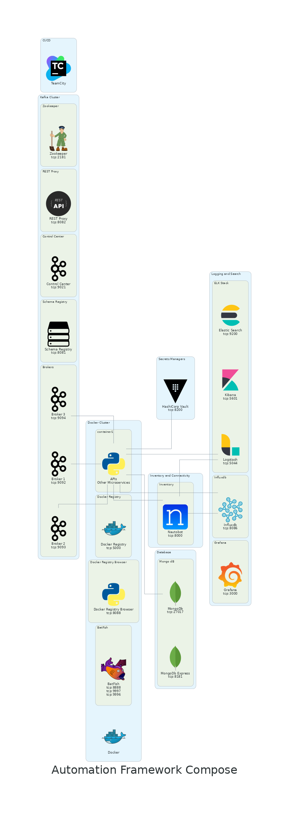

# automation-framework
Automation Framework

**This is not meant to be in production, this is a development environment**

## Assumptions if you are using Docker with or without Swarm Mode

1. You know the basics of [Docker](https://www.docker.com/).
2. You know the basics of [Docker Compose](https://docs.docker.com/compose/).
3. You know the basics of [Docker Swarm](https://docs.docker.com/engine/swarm/).

## Assumptions if you are using Kubernetes single node or cluster
1. You are using [microk8s](https://microk8s.io/).
2. You have enabled [add-ons](https://microk8s.io/docs/addons) dns, metallb, 
   storage, and registry in [microk8s](https://microk8s.io/).
3. You know the basics of [Kubernetes/k8s](https://kubernetes.io/).
4. You know the basics of [Kubernetes YAML](https://kubernetes.io/docs/reference/).


## General Information

* The base Makefile is meant to be used with Docker Swarm

* The Makefile located in docker/compose is used for individual architecture pieces

* **Compose** does not have memory limits

### Possible Special Need for ELK

* You may need to run this command on the host system

```text
sysctl -w vm.max_map_count=262144
```

### Nautobot required after creating container

* You need to create a super user use the following command, and follow prompts.

```text
docker exec -it <container-name> nautobot-server createsuperuser
```

### Graphana iformation

* Default username admin default password admin

* It will ask you to change the password on first login

### Docker registry information

* This is a **insecure** registry the following must be done to use it

1. create daemon.json in /etc/docker and add the following

```json
{
  "insecure-registries" : ["<ip or domain name>:5000"]
}
```

2. restart docker daemon

```text
sudo systemctl restart docker
```

3. In order to use the registry in compose you must log in using the credentials' admin/admin

```text
docker login <ip or domain name>:5000 -u admin -p admin
```

4. You can verify you are logged in by looking in ~/.docker/config.json you should see something like this

```json
{
	"auths": {
		"<ip or domain name>:5000": {
			"auth": "secret-key"
		}
	}
}

```

5. To check images you add in it. In your browser.

```text

# To see your repositories
http://<ip or domain name>:5000/v2/_catalog

# To see the tags in your repositories
http://<ip or domain name>:5000/v2/<repo-name>/tags/list
```

### Information URLs

* [vm.max_map_count](https://www.elastic.co/guide/en/elasticsearch/reference/5.0/vm-max-map-count.html#vm-max-map-count)
* [curl examples send data to ELK](https://mindmajix.com/elasticsearch/curl-syntax-with-examples)
* [nautobot-lab reference](https://github.com/nautobot/nautobot-lab)
* [Docker](https://www.docker.com/)
* [Docker Compose](https://docs.docker.com/compose/)
* [Docker Swarm](https://docs.docker.com/engine/swarm/)
* [Dockerfile Reference](https://docs.docker.com/engine/reference/builder/)
* [Docker Compose Reference](https://docs.docker.com/compose/compose-file/)
* [Docker Registry Detail](https://docs.docker.com/registry/)
* [Kubernetes/k8s](https://kubernetes.io/)
* [Kubernetes YAML](https://kubernetes.io/docs/reference/)
* [microk8s](https://microk8s.io/)
* [microk8s add-ons](https://microk8s.io/docs/addons)
* [kompose](https://kompose.io/)

### What is Available in Swarm

| ARCHITECTURE | USED FOR |
|---|---|
| Kafka | As a message bus |
| ELK Elastic Search | Logging search, various other stuff |
| Hashicorp Vault | Secrets Storage |
| Nautobot | "Source of truth" |
| A Genie Parser | Something to parse show commands |


### What is Available in Compose and Kubernetes

| ARCHITECTURE | USED FOR |
|---|---|
| Kafka | As a message bus |
| ELK Elastic Search | Logging search, various other stuff |
| Hashicorp Vault | Secrets Storage |
| Nautobot | "Source of truth" |
| A Genie Parser | Something to parse show commands |
| MongoDB | Document dB |
| Batfish | Modeling |
| Influxdb | Series dB |
| Grafana | Pretty Graphs |
| Docker Registry | To hold docker images |
| Docker Registry Browser | To Browse the Registry |


